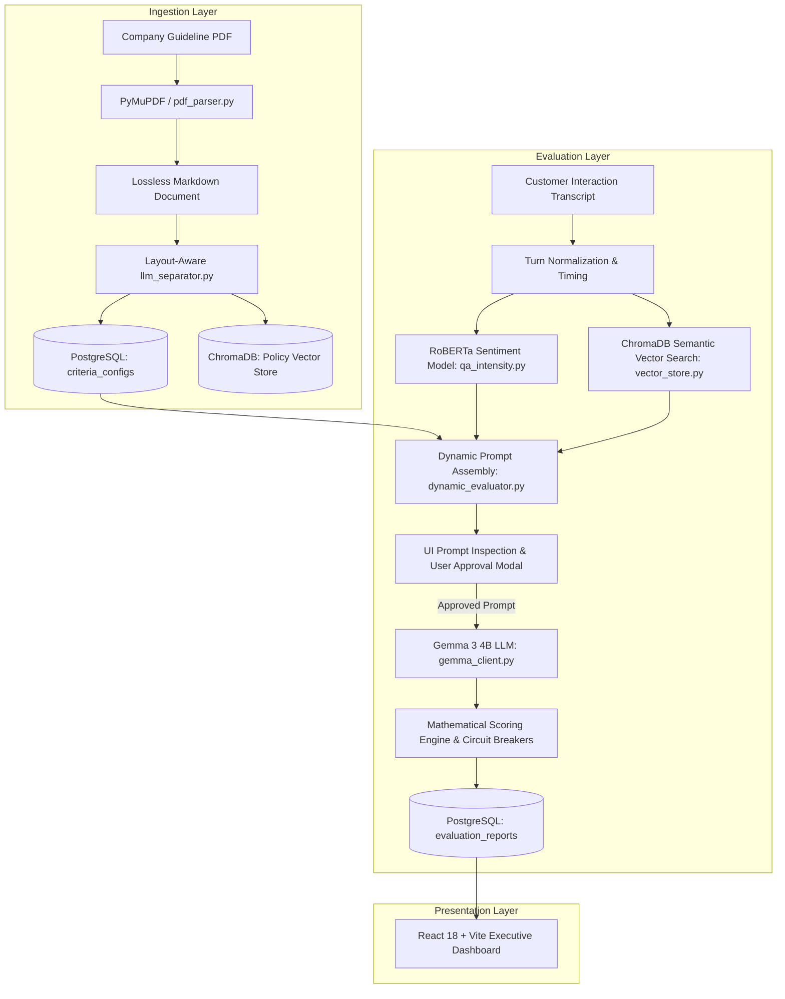

# 🎯 Multi-Tenant Automated QA Intelligence Platform

> **Production-grade AI-powered Quality Assurance platform for enterprise contact centers.**  
> Automatically ingests company guideline PDFs into lossless Markdown, dynamically extracts custom category weights, verbatim spiels, and auto-fail rules, indexes operational policies into ChromaDB Vector RAG, and audits omni-channel customer interactions (Calls, Emails, Chats) using **Gemma 3 4B** and **RoBERTa Sentiment Analysis**.

---

## 📑 Table of Contents

- [Architectural Overview](#-architectural-overview)
- [Key Features](#-key-features)
- [Directory Structure & File Manifest](#-directory-structure--file-manifest)
- [Prerequisites](#-prerequisites)
- [Step-by-Step Installation & Setup](#-step-by-step-installation--setup)
- [How to Run the Application](#-how-to-run-the-application)
- [REST API Reference](#-rest-api-reference)
- [Dynamic Prompt Builder & Verification](#-dynamic-prompt-builder--verification)
- [Automated Testing & Code Verification](#-automated-testing--code-verification)

---

## 🏗️ Architectural Overview

The platform uses a layered microservice-ready architecture separating document ingestion, semantic search, sentiment modeling, dynamic prompt synthesis, and deterministic mathematical scoring:



---

## ✨ Key Features

1. **Multi-Tenant Architecture & Company Switching**:
   - Complete data isolation per tenant (e.g. S-NET Communications, BrightWave Retail, custom clients).
   - Dedicated PostgreSQL schemas for guidelines, criteria configurations, and historical audits.
2. **Lossless PDF-to-Markdown Ingestion**:
   - Converts multi-page, multi-channel guideline PDFs into structured, searchable Markdown tables and sections.
3. **Dynamic Rule-Based Criteria & Policy Separator**:
   - **Zero hardcoding**: Extracts exact company percentage weights (e.g. `30%/45%/25%` vs `25%/50%/25%`), line items, and required verbatim greeting/closing scripts directly from document layout.
   - Extracts Auto-Fail Zero-Tolerance rules directly into circuit breakers.
4. **Vector Database Policy Knowledge Base (ChromaDB)**:
   - Indexes company-specific operating procedures (Hold/Silence SLAs, Customer Verification protocols, Escalation paths, CRM documentation standards) with `all-MiniLM-L6-v2` dense embeddings.
5. **RoBERTa Sentiment & Intensity Analyzer**:
   - Identifies tense conversational moments and flags harsh agent statements to support objective tone deductions.
6. **Dynamic LLM Prompt Builder & Approval Loop**:
   - Constructs guardrailed prompts injecting company criteria, RAG policy evidence, and sentiment flags.
   - **UI Prompt Preview Modal**: Allows auditors to inspect, copy, or edit the prompt before triggering analysis.
7. **Deterministic Mathematical Scorecard Engine**:
   - Enforces arithmetic formula scoring: \(\text{Final Score} = \sum (\text{Category Score} \times \text{Weight})\).
   - Instant \(0 / 100\) score if any Auto-Fail circuit breaker is triggered.
8. **In-Depth Historical QA Audits**:
   - Historical evaluation logs in PostgreSQL with row-by-row inspection modal, per-record deletion, and bulk clear options.

---

## 📂 Directory Structure & File Manifest

```text
gemma-qa-analysis/
├── main.py                          # Server launcher for FastAPI backend (port 8000)
├── requirements.txt                 # Python dependencies
├── prompt-builder.md                # Technical guide for the Prompt Builder pipeline (English)
├── prompt-builder-sinhala.md        # Technical guide for the Prompt Builder pipeline (Sinhala)
├── run_guide.md                     # Step-by-step operational setup guide
├── request.http                     # VS Code / Postman HTTP API request collection
│
├── inputs/                          # Modular sample interaction files (JSON)
│   ├── 01_call_compliant.json       # Compliant phone call sample
│   ├── 02_call_hold_violation.json  # Call sample with hold time SLA violation
│   ├── 03_call_autofail.json        # Call sample with auto-fail discourtesy violation
│   ├── 04_email_compliant.json      # Compliant email support interaction
│   └── 05_chat_compliant.json       # Compliant live chat support interaction
│
├── src/                             # Core Python Backend
│   ├── api/
│   │   ├── __init__.py
│   │   ├── web_app.py               # Main FastAPI application with REST endpoints & CORS
│   │   └── job_queue.py             # Asynchronous task and analysis worker queue
│   │
│   ├── core/
│   │   ├── __init__.py
│   │   ├── gemma_client.py          # Ollama Gemma 3 4B client wrapper & token counter
│   │   ├── report_pdf.py            # PDF report generator (FPDF2)
│   │   └── weights_config.py        # Static weights loader/persister
│   │
│   ├── db/
│   │   ├── __init__.py
│   │   ├── database.py              # PostgreSQL engine and session factory (SQLAlchemy)
│   │   └── models.py                # PostgreSQL ORM models (Tenant, Document, CriteriaConfig, EvaluationReport)
│   │
│   ├── rag/
│   │   ├── __init__.py
│   │   ├── pdf_parser.py            # PyMuPDF lossless PDF-to-Markdown table parser
│   │   ├── llm_separator.py         # Rule-based dynamic Criteria & Policy chunk extractor
│   │   ├── vector_store.py          # ChromaDB Vector Store client & semantic search
│   │   ├── rag_accuracy.py          # Semantic accuracy checker against reference Q&A
│   │   └── rag_compliance.py        # Semantic compliance violation detector
│   │
│   └── services/
│       ├── __init__.py
│       ├── dynamic_evaluator.py     # Orchestrates Prompt Builder, Gemma inference & math scorecard
│       ├── qa_intensity.py          # RoBERTa sentiment intensity analyzer
│       ├── qa_agent.py              # Legacy agent scorecard evaluator
│       ├── qa_summary.py            # Interaction executive summary prompt
│       ├── qa_suggestions.py        # Actionable coaching recommendations prompt
│       └── response_time.py         # Transcript timestamp parser & latency calculator
│
├── frontend/                        # React 18 + Vite Executive Frontend
│   ├── index.html                   # HTML entry point
│   ├── package.json                 # Node.js dependencies & scripts
│   ├── vite.config.js               # Vite configuration
│   └── src/
│       ├── main.jsx                 # React root renderer with BrowserRouter
│       ├── App.jsx                  # Main router view with Navigation & Layout
│       ├── index.css                # Tailwind CSS styling (Executive Light Theme)
│       ├── context/
│       │   └── TenantContext.jsx    # Global active tenant context & API client state
│       ├── components/
│       │   ├── Navbar.jsx           # Top navigation bar with live tenant switcher
│       │   ├── CreateTenantModal.jsx# Modal to register a new company tenant
│       │   ├── AuditDetailModal.jsx # Full-page modal for in-depth QA evaluation breakdowns
│       │   └── PromptPreviewModal.jsx# Inspection & approval modal for built LLM prompts
│       └── pages/
│           ├── UploadMarkdownPage.jsx # PDF upload, file list, delete, and lossless Markdown viewer
│           ├── CriteriaPolicyPage.jsx # Category weights, line items, and RAG knowledge chunks
│           ├── LiveQAPage.jsx       # Sample loader, JSON uploader, prompt preview & live QA
│           └── AuditHistoryPage.jsx # Historical audit logs table with per-record deletion
│
└── tests/                           # Verification & Unit Tests
    ├── test_both_companies.py       # Verifies distinct criteria extraction for multiple companies
    └── test_full_separator.py       # Verifies table parsing, SLAs, and dynamic RAG policy chunks
```

---

## ⚙️ Prerequisites

Before running the project, ensure the following software is installed on your system:

1. **Python 3.10+** (Tested on Python 3.11 / 3.12)
2. **Node.js 18+** & **npm**
3. **PostgreSQL 14+** running locally or remotely
4. **Ollama** installed with **Gemma 3 4B**:
   ```bash
   ollama pull gemma3:4b
   ```

---

## 🚀 Step-by-Step Installation & Setup

### 1. Configure PostgreSQL Database

Ensure PostgreSQL is running and credentials match your environment variables (or defaults):

```bash
# Default credentials used:
# Host: localhost:5432
# Username: postgres
# Password: root (or your local password via DB_PASSWORD environment variable)
# Database: qa_database
```

You can set custom database credentials via environment variables:

```bash
export DB_USER="postgres"
export DB_PASSWORD="your_password"
export DB_HOST="localhost"
export DB_PORT="5432"
export DB_NAME="qa_database"
```

### 2. Backend Setup (Python Virtual Environment)

```bash
# 1. Navigate to project root
cd gemma-qa-analysis

# 2. Create virtual environment
python -m venv venv

# 3. Activate virtual environment
# Windows PowerShell:
.\venv\Scripts\Activate.ps1
# Linux / macOS:
source venv/bin/activate

# 4. Install dependencies
pip install -r requirements.txt
```

### 3. Frontend Setup (React Vite Dashboard)

```bash
# 1. Navigate to frontend directory
cd frontend

# 2. Install dependencies
npm install

# 3. Build/verify production bundle
npm run build
```

---

## 🏃 How to Run the Application

### Start the Backend Web Server

From the project root with the virtual environment activated:

```bash
python main.py
```

> Backend API server starts on **`http://localhost:8000`** with automatic OpenAPI documentation at **`http://localhost:8000/docs`**.

### Start the Frontend Dashboard

In a separate terminal window:

```bash
cd frontend
npm run dev
```

> Frontend client starts on **`http://localhost:5173`**.

---

## 🌐 REST API Reference

| Method   | Endpoint                               | Description                                                                 |
| :------- | :------------------------------------- | :-------------------------------------------------------------------------- |
| `GET`    | `/api/tenants`                         | List all registered company tenants                                         |
| `POST`   | `/api/tenants`                         | Register a new company tenant (`{ id, name, description }`)                 |
| `POST`   | `/api/tenants/{id}/upload-pdf`         | Upload company guideline PDF, convert to Markdown, and index into Vector DB |
| `GET`    | `/api/tenants/{id}/markdown`           | Retrieve converted Markdown text for the active tenant                      |
| `GET`    | `/api/tenants/{id}/criteria`           | Retrieve parsed Category Weights, Line Items, and Auto-Fails                |
| `GET`    | `/api/tenants/{id}/policies`           | Retrieve indexed ChromaDB Vector policy chunks                              |
| `GET`    | `/api/tenants/{id}/documents`          | List uploaded guideline documents with metadata                             |
| `DELETE` | `/api/tenants/{id}/documents/{doc_id}` | Delete a single uploaded document and clean criteria                        |
| `DELETE` | `/api/tenants/{id}/knowledge-base`     | Clear all documents, criteria, and vector embeddings for tenant             |
| `GET`    | `/api/samples`                         | List all sample conversation JSON files in `inputs/`                        |
| `POST`   | `/api/tenants/{id}/preview-prompt`     | Assemble and preview the exact LLM prompt without running inference         |
| `POST`   | `/api/tenants/{id}/evaluate`           | Execute dynamic QA analysis with Gemma 3 4B & RoBERTa                       |
| `GET`    | `/api/evaluations`                     | List historical evaluation reports (`?tenant_id=...`)                       |
| `GET`    | `/api/evaluations/{eval_id}`           | Get in-depth QA audit breakdown for a specific evaluation                   |
| `DELETE` | `/api/evaluations/{eval_id}`           | Delete an individual evaluation record from PostgreSQL                      |
| `DELETE` | `/api/evaluations`                     | Clear all evaluation logs for a tenant                                      |

---

## 🔍 Dynamic Prompt Builder & Verification

For a complete breakdown of how prompts are assembled dynamically from company criteria, RoBERTa tone markers, and ChromaDB policy chunks, see:

- 📖 **[Prompt Builder Technical Documentation (English)](prompt-builder.md)**

---

## 🧪 Automated Testing & Code Verification

To verify criteria separation, layout parsing, and scoring across multiple companies, run the test suite:

```bash
# Run distinct company extraction test
python tests/test_both_companies.py

# Run full layout & RAG policy separator test
python tests/test_full_separator.py
```
