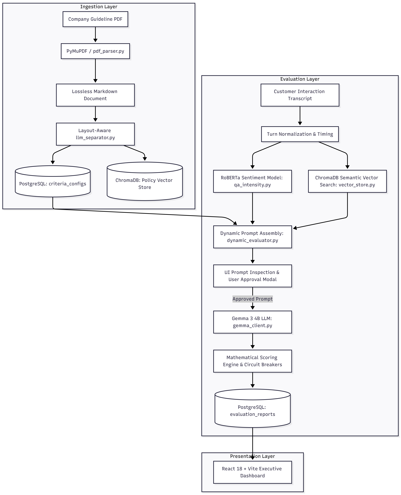

# 🚀 Multi-Tenant Automated QA Intelligence Platform

> **Production-grade AI-powered Quality Assurance platform for enterprise contact centers.**  
> Automatically ingests company guideline PDFs into lossless Markdown, dynamically extracts custom category weights, verbatim spiels, and auto-fail rules, indexes operational policies into ChromaDB Vector RAG, and audits omni-channel customer interactions (Calls, Emails, Chats) using **Gemma 3 4B** and **RoBERTa Sentiment Analysis**.

---

## 📋 Table of Contents

- [Architectural Overview](#-architectural-overview)
- [Key Features](#-key-features)
- [Directory Structure & File Manifest](#-directory-structure--file-manifest)
- [Prerequisites](#-prerequisites)
- [Step-by-Step Installation & Setup](#-step-by-step-installation--setup)

---

## 🏗️ Architectural Overview

The platform uses a layered microservice-ready architecture separating document ingestion, semantic search, sentiment modeling, dynamic prompt synthesis, and deterministic mathematical scoring:

---

## ✨ Key Features

1. **Multi-Tenant Architecture & Company Switching**:
   - Complete data isolation per tenant (e.g. S-NET Communications, BrightWave Retail, custom clients).
   - Dedicated PostgreSQL schemas for guidelines, criteria configurations, and historical audits.
2. **Lossless PDF-to-Markdown Ingestion**:
   - Converts multi-page, multi-channel guideline PDFs into structured, searchable Markdown tables and sections.
3. **Dynamic Rule-Based Criteria & Policy Separator**:
   - **Zero hardcoding**: Extracts exact company percentage weights (e.g. 30%/45%/25% vs 25%/50%/25%), line items, and required verbatim greeting/closing scripts directly from document layout.
   - Extracts Auto-Fail Zero-Tolerance rules directly into circuit breakers.
4. **Vector Database Policy Knowledge Base (ChromaDB)**:
   - Indexes company-specific operating procedures (Hold/Silence SLAs, Customer Verification protocols, Escalation paths, CRM documentation standards) with ll-MiniLM-L6-v2 dense embeddings.
5. **RoBERTa Sentiment & Intensity Analyzer**:
   - Identifies tense conversational moments and flags harsh agent statements to support objective tone deductions.
6. **Dynamic LLM Prompt Builder & Approval Loop**:
   - Constructs guardrailed prompts injecting company criteria, RAG policy evidence, and sentiment flags.
   - **UI Prompt Preview Modal**: Allows auditors to inspect, copy, or edit the prompt before triggering analysis.
7. **Deterministic Mathematical Scorecard Engine**:
   - Enforces arithmetic formula scoring: \(\text{Final Score} = \sum (\text{Category Score} \times \text{Weight})\).
   - Instant \(0 / 100\) score if any Auto-Fail circuit breaker is triggered.
8. **In-Depth Historical QA Audits**:
   - Historical evaluation logs in PostgreSQL with row-by-row inspection modal, per-record deletion, and bulk clear options.

---

## 📂 Directory Structure & File Manifest

`	ext
gemma-qa-analysis/
├── main.py                          # Server launcher for FastAPI backend (port 8000)
├── requirements.txt                 # Python dependencies
├── .env                             # Environment variables & Prompt Paths
├── resources/                       # Architectural diagrams & Text Prompts
│   ├── prompts/                     # Extracted LLM Prompts (.txt)
│   ├── architectural-overview.png   
│   └── prompt-builder-overview.png  
├── frontend/                        # Dedicated React/Vite Frontend
│   ├── public/                      
│   │   └── queue.html               # Queue Monitor static HTML
│   └── src/                         # React UI logic
├── src/                             # Core Python Backend
│   ├── api/
│   │   └── web_app.py               # Main FastAPI application with Multi-Tenant REST endpoints
│   ├── core/
│   │   └── gemma_client.py          # Ollama Gemma 3 4B client wrapper & token counter
│   ├── db/
│   │   ├── database.py              # PostgreSQL engine and session factory
│   │   └── models.py                # PostgreSQL ORM models (Tenant, Document, CriteriaConfig, EvaluationReport)
│   ├── rag/
│   │   ├── pdf_parser.py            # PyMuPDF lossless PDF-to-Markdown table parser
│   │   ├── llm_separator.py         # Rule-based dynamic Criteria & Policy chunk extractor
│   │   └── vector_store.py          # ChromaDB Vector Store client & semantic search
│   └── services/
│       ├── dynamic_evaluator.py     # Orchestrates Prompt Builder, Gemma inference & math scorecard
│       ├── qa_intensity.py          # RoBERTa sentiment intensity analyzer
│       ├── qa_summary.py            # Interaction executive summary logic
│       ├── qa_suggestions.py        # Actionable coaching recommendations logic
│       └── response_time.py         # Transcript timestamp parser & latency calculator
└── tests/                           # Integration and Demo test scripts
`

---

## 🛠️ Step-by-Step Installation & Setup

1. **Install dependencies**:
   `ash
   pip install -r requirements.txt
   `
2. **Set up PostgreSQL** and configure .env.
3. **Start the backend**:
   `ash
   python main.py
   `
4. **Start the frontend** (if using React/Vite):
   `ash
   cd frontend
   npm install
   npm run dev
   `
