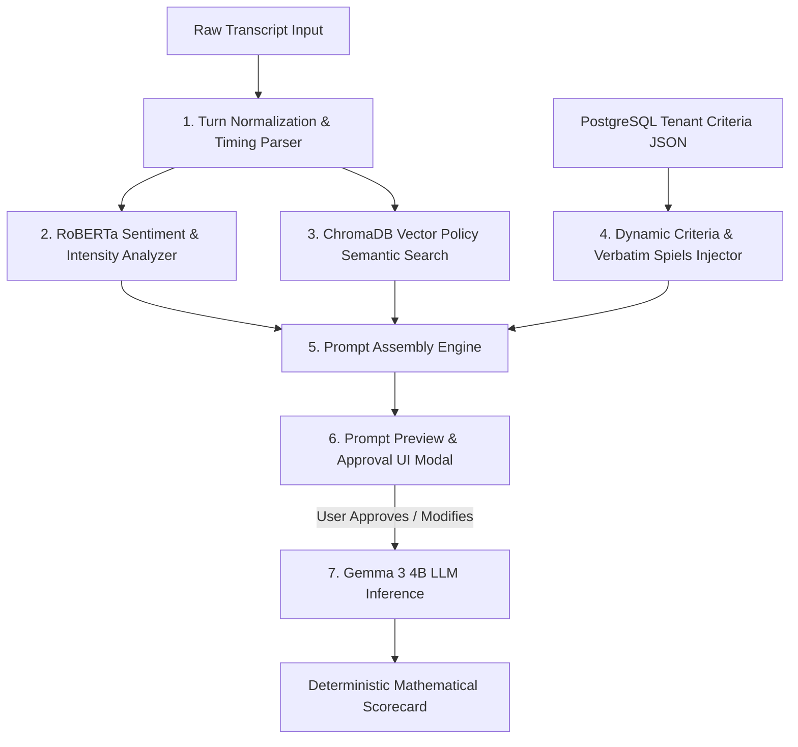

# 🛠️ Dynamic LLM Prompt Builder Guide

This document explains the step-by-step architecture and engineering behind how **Automated QA Intelligence** dynamically constructs context-rich, guardrailed prompts for **Gemma 3 4B** to perform multi-tenant call, email, and chat evaluations.

---

## 🏗️ Prompt Construction Pipeline Overview

The system uses a **7-Stage Dynamic Assembly Pipeline** before sending any prompt to Gemma 3 4B:



---

## 📑 The 7 Stages of Prompt Construction

### 1. Speaker & Turn Normalization
- **Purpose**: Converts varied transcripts (e.g. `[00:05] Agent:`, `(01:20) Support:`, `Caller:`, `Bot:`) into consistent, structured `(Speaker, Text)` dialogue turns.
- **Timing Extraction**: Parses timestamps (e.g. `[00:15]`) into elapsed seconds to track hold durations and conversational latency.

### 2. RoBERTa Emotion & Tone Marker Injection
- **Model**: `cardiffnlp/twitter-roberta-base-sentiment-latest`
- **Purpose**: Detects conversational tension, customer frustration, and agent harshness per turn.
- **Injected Prompt Block**:
  - `FLAGGED TENSE MOMENTS`: Turns where customer negative emotion exceeds the intensity threshold.
  - `HARSH/NEGATIVE AGENT LINES`: Turns where agent statements scored low sentiment (used as strict evidence for tone penalties).

### 3. Vector RAG Policy Evidence Injection
- **Database**: ChromaDB Vector Store with `all-MiniLM-L6-v2` embeddings.
- **Purpose**: Dynamically searches the company's indexed guideline policies (Hold SLAs, Verification standards, Escalation protocols) based on customer queries in the transcript.
- **Injected Prompt Block**:
  ```text
  COMPANY POLICY CONTEXT (Retrieved from Knowledge Base):
  • S-NET Communications - Hold Time & Dead Air Protocol: Inform customer, set expectations... Hold max 3 mins...
  • S-NET Communications - Customer & Account Validation Standard: Validate Caller name, Company name, Email...
  ```

### 4. Dynamic Criteria & Verbatim Spiels Injection
- **Source**: Extracted losslessly from the company's uploaded PDF/Markdown guideline and stored in PostgreSQL `criteria_configs`.
- **Purpose**: Supplies the exact line items, category groupings, and verbatim quotes required for the specific company and channel.
- **Injected Prompt Block**:
  ```text
  EVALUATION LINE ITEMS TO RATE:
  - [Soft Skills] Branding and Survey: Adhered to greeting/closing [Required Spiels: "Thank you for calling S-NET Communications...", "Thank you for Choosing S-NET and have a great day."]
  - [Technical Knowledge] Verified customer: Validated name, company, email, contact number.
  - [Process Knowledge] Case Tagging: Correct contact, location, and issue type tagging.
  ```

### 5. Strict Role & Rating Criteria Definition
- **System Persona**: Informs the LLM that it is acting as a *Strict Quality Assurance Auditor* for the specified channel (`Call`, `Email`, or `Chat`).
- **Standardized Rating Scale**:
  - `PASS`: Complied with all policy requirements and mandatory scripts.
  - `PARTIAL`: Minor deviation, slight delay, or partial script delivery.
  - `FAIL`: Clear breach of procedure, missing required fields, or impolite tone.

### 6. Strict Output Format Guardrail
- **Instruction**: Instructs Gemma 3 4B to output deterministic, line-by-line verdicts:
  ```text
  OUTPUT FORMAT INSTRUCTIONS:
  Reply with ONE line per line item in this exact format:
  Line Item Name: PASS/PARTIAL/FAIL - Short specific audit reason.
  ```

---

## 🔍 Full Example of a Built Prompt

Below is a full example of an assembled prompt generated for **BrightWave Retail**:

```text
You are a STRICT Call Quality Assurance Auditor evaluating a Call interaction.
Your task is to judge the AGENT against each specific evaluation line item.

RATING CRITERIA:
- PASS: Agent met all requirements, was polite, helpful, and followed required spiels/policies.
- PARTIAL: Agent was partially compliant, missed a spiel minorly, or showed minor delays.
- FAIL: Agent was rude, unhelpful, failed policy, or refused to help.

COMPANY POLICY CONTEXT (Retrieved from Knowledge Base):
• BrightWave Retail - Hold & Silence Management SLA: Notify customer before hold. Max 2-minute segments. Silence max 15s. Grace allowance 4s.
• BrightWave Retail - Identity & Order Verification Standard: 4 fields must ALL be verified: Full name, Email, Phone, Order/Case #.
• BrightWave Retail - Supervisor Escalation & Membership Retention: Warm transfer required on supervisor request or cancellation threat.

EVALUATION LINE ITEMS TO RATE:
- [Communication Skills] Greeting & Sign-off: The agent used the approved opening script [Required Spiels: "Thanks for calling BrightWave Retail, this is ____, how can I make your day better?", "Thanks again for shopping with BrightWave — have a wonderful day!"]
- [Communication Skills] Hold & Silence Management: Hold segments max 2 mins, silence max 15s.
- [Problem Resolution] Restated the Issue: Restated concern in own words.
- [Problem Resolution] Identity & Order Verification: Confirmed 4 fields: full name, email, phone, order #.
- [Compliance & Documentation] Case Notes: Complete and accurate notes submitted within 20 mins.

FLAGGED TENSE MOMENTS:
- Turn 3 (Client): I was charged twice for my subscription this month and I want it fixed immediately.

HARSH/NEGATIVE AGENT LINES (Weigh heavily for tone):
- (none)

TRANSCRIPT:
[00:00] Agent: Thanks for calling BrightWave Retail, this is Alex, how can I make your day better?
[00:06] Client: I was charged twice for my subscription this month and I want it fixed immediately.
[00:12] Agent: I completely understand, and I'm very sorry for the confusion. Let me pull up your account. May I confirm your full name, email, phone number, and order number?
[00:22] Client: Sure, John Doe, john@example.com, 555-0199, order #BW-8821.
[00:35] Agent: Thank you Mr. Doe. I see the duplicate charge and I have processed an immediate refund. It will reflect in 3-5 business days.
[00:45] Client: Awesome, thank you so much Alex.
[00:48] Agent: You're very welcome! Thanks again for shopping with BrightWave — have a wonderful day!

OUTPUT FORMAT INSTRUCTIONS:
Reply with ONE line per line item in this exact format:
Line Item Name: PASS/PARTIAL/FAIL - Short specific audit reason.
```

---

## 🛡️ User Approval & Editing Loop in UI

1. On the **Live QA Test** page (`/test`), after selecting or pasting a transcript, click **"Preview Built Prompt"**.
2. The **LLM Prompt Builder & Inspection Modal** opens:
   - Displays all injected RAG policies, sentiment flags, and criteria line items.
   - Allows copying the full prompt or **editing the prompt string directly** before inference.
3. Clicking **"Approve & Run Analysis"** executes Gemma 3 4B evaluation with the verified prompt.
